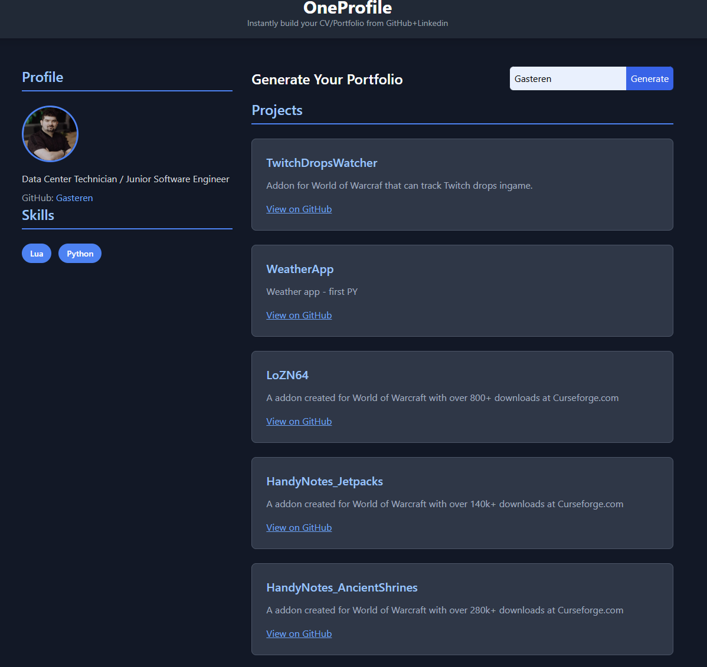

# OneProfile

**Instantly build your professional portfolio from GitHub + LinkedIn, in one click.**

OneProfile helps developers and tech professionals generate a clean, shareable portfolio by combining public GitHub data with a LinkedIn-style profile. Whether you're a hobbyist or a job seeker, OneProfile gives you a no-fuss way to showcase your projects, skills, and background.

---

> 

---

## 🔧 Features

- 🖼️ **Auto-generated Portfolio**  
  Enter your GitHub/LinkedIn username to generate a personalized showcase.

- 🧠 **Smart Project Listing**  
  Projects include title, description, and GitHub links.

- 💼 **Professional Snapshot**  
  Displays job title, GitHub handle, and skill tags.

- 🧩 **Tech Tags**  
  Automatically detects languages and frameworks (e.g., Lua, Python).

- 🔗 **Clean UI Design**  
  Inspired by LinkedIn’s simplicity and GitHub’s developer focus.

---

## 🚀 Getting Started

1. **Create a `.env` file in the root directory:** **[Generate Token](https://github.com/settings/tokens)
   ```bash
   GITHUB_TOKEN=your_personal_access_token
   ```
2. **Install dependencies:**
   ```bash
   npm install
   ```
3. **Run the app:**
Locate the folder and run Node:
   ```bash
   node server.js
   ```
4. For the frontend index.html use Live Server in VS Code or npx.
   ```bash
   npx serve
   ```
